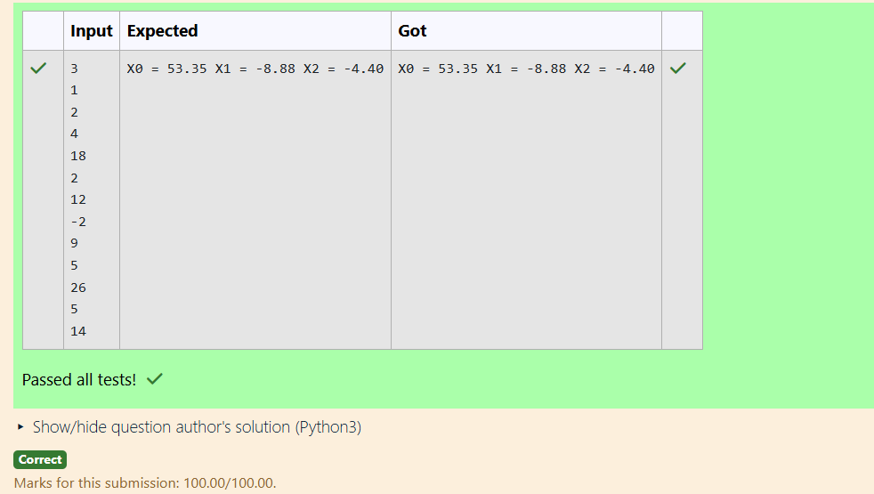

# Gaussian Elimination

## AIM:
To write a program to find the solution of a matrix using Gaussian Elimination.

## Equipments Required:
1. Hardware – PCs
2. Anaconda – Python 3.7 Installation / Moodle-Code Runner

## Algorithm
1. Augment the Matrix: Combine the coefficients of the variables and constants into an augmented matrix.
2. Forward Elimination: Make the diagonal element in each row a pivot (non-zero).
Eliminate all elements below the pivot in the same column by subtracting a multiple of the pivot row.
3.Back Substitution: Solve for variables starting from the last row and substitute these into the preceding rows to find other variables. 
4.Output the Solution: Display the solved values of the variables in order 

## Program:
```
Program to solve a matrix using Gaussian elimination without partial pivoting.
Developed by:AYSHWARIYA.J 
RegisterNumber:24901138

import numpy as np
import sys
n=int(input())
a=np.zeros((n,n+1))
x=np.zeros(n)
for i in range(n):
    for j in range(n+1):
      a[i][j]=float(input())
for i in range(n):
    if a[i][i] ==0.0:
      sys.exit('Divide by zero detected!')
    for j in range(i+1,n):
      ratio = a[j][i]/a[i][i]
      for k in range(n+1):
          a[j][k]= a[j][k]-ratio*a[i][k]
x[n-1]=a[n-1][n]/a[n-1][n-1]
for i in range(n-2,-1,-1):
    x[i]=a[i][n]
    for j in range(i+1,n):  
        x[i]=x[i]-a[i][j]*x[j]
    x[i]=x[i]/a[i][i]
for i in range(n):
    print('X%d = %0.2f '%(i,x[i]),end='')

```

## Output:



## Result:
Thus the program to find the solution of a matrix using Gaussian Elimination is written and verified using python programming.

